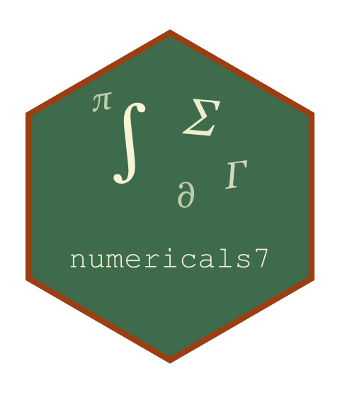

<!-- README.md is generated from README.Rmd. Please edit that file, then
     regenerate with devtools::build_readme(). Do not use knitr::knit(): it
     processes the code but leaves this YAML header in the output as literal
     text, which GitHub and pkgdown both render verbatim. -->

<!-- badges: start -->

[](https://github.com/statmodels7/numericals7/actions/workflows/R-CMD-check.yaml)
[](https://app.codecov.io/gh/statmodels7/numericals7)
[](https://lifecycle.r-lib.org/articles/stages.html#experimental)
<!-- badges: end -->

# numericals7 

Every package of the [statmodels7](https://statmodels7.github.io)
toolkit needs the same numerical machinery – finite-difference stencils,
quadrature, special functions, the combinatorics behind a chain rule –
and before this package existed each had quietly grown its own copy: the
same set-partition enumeration was written twice, finite differences
three times. `{numericals7}` is that machinery written once, at the
bottom of the toolkit, where everything above can consume it.

## Installation

``` r
# install.packages("pak")
pak::pak("statmodels7/numericals7")
```

## The enumerations behind a chain rule

A derivative of order four over several variables is a sum over
combinatorial objects, and an enumeration that exists in one copy cannot
disagree with itself:

``` r
# the multi-indexes that key a derivative list (diagonal first at order 2)
tuple_indices(2, 2)
#> [[1]]
#> [1] 1 1
#> 
#> [[2]]
#> [1] 2 2
#> 
#> [[3]]
#> [1] 1 2

# the set partitions a Faa di Bruno formula sums over: 1, 2, 5, 15
lengths(lapply(1:4, set_partitions))
#> [1]  1  2  5 15

# the weak compositions of n into k parts -- the support of a multinomial
compositions(3, 2)
#>      [,1] [,2]
#> [1,]    0    3
#> [2,]    1    2
#> [3,]    2    1
#> [4,]    3    0
```

## One stencil library

`fd_weights()` builds the finite-difference weights for any derivative
order at any offsets from one Vandermonde system, `fd_offsets()` chooses
the offsets, `fd_step()` the step, and `fd_derivative()` assembles the
three. The toolkit’s policy – one stencil applied to the highest
analytic order, never a chain of first differences – stays with the
packages that enforce it; this is the stencil itself, written once.

``` r
# the classical five-point first-derivative weights, and a derivative
fd_weights(-2:2, 1L) * 12
#> [1]  1 -8  0  8 -1
fd_derivative(exp, 1, order = 3L, accuracy = 4L) - exp(1)
#> [1] 3.076484e-09
```

## Quadrature and series, vectorized over the parameters

A regression model gives every observation its own parameter value, so
the integrals a fit needs come in families: the same integrand at
hundreds of parameter rows. `quad_vec()` integrates all of them in one
adaptive pass – the integrand receives a matrix of points and a row
index, so a thousand parameter values cost matrix evaluations rather
than a thousand adaptive runs – and `series_vec()` does the same for
infinite sums. A row that cannot reach the requested accuracy returns
`NA` with a warning naming it.

``` r
shp <- c(0.5, 2, 5, 50)
f <- function(x, i) x * dgamma(x, shape = shp[i], rate = 1)
quad_vec(f, 0, rep(Inf, 4))          # the means, one call
#> [1]  0.5  2.0  5.0 50.0

lam <- c(0.5, 4, 300)
series_vec(function(k, i) dpois(k, lam[i]), n = 3)   # masses sum to one
#> [1] 1 1 1
```

## The logarithm of the modified Bessel functions

Bessel functions recur across distributions – the von Mises carries
$I_0$, the Poisson-inverse Gaussian carries $K_{y-1/2}$ – and both
overflow from $x = 700$ while their exponentially scaled forms underflow
past $10^5$ or lose large orders entirely. Following Plesner, Sørensen
and Hauberg (ICS 2024, arXiv:2409.08729), `log_bessel_i()` and
`log_bessel_k()` carry every intermediate quantity on the log scale, so
the result is finite and accurate wherever $\log I_\nu(x)$ itself is
representable; the `_derivs` variants add four derivatives in the
argument from the ratio identity and the Bessel equation, at the cost of
one more log-Bessel evaluation.

``` r
log_bessel_i(1e7, 2)              # I overflows at 700; the log is just a number
#> [1] 9999991
log_bessel_i(0.001, 5000)         # the scaled form loses this order entirely
#> [1] -75595.66
log_bessel_k_derivs(2, 0.5)$d1    # exactly -1/(2x) - 1 at nu = 1/2
#> [1] -1.25
```

## Special functions, with their overflow discipline

Each of these was born inside a distribution and carries the numerical
lesson learned there: the Mills ratio is formed on the log scale, where
the direct quotient is 0/0 from `t = -38` on; Owen’s T batches every
element into one `quad_vec()` call; the Bessel ratio goes through the
exponentially scaled Bessel functions, so it is finite at any argument,
and its inverse comes with the four derivatives the inverse function
rule provides.

``` r
mills_ratio(-40)$r        # finite, close to 40
#> [1] 40.02497
owen_t(0, 1) * 2 * pi     # atan(1) = pi/4
#> [1] 0.7853982
bessel_i_ratio(1000)      # the unscaled ratio overflows past 700
#> [1] 0.9994999
bessel_i_ratio(bessel_i_ratio_inverse(0.7)$kappa)
#> [1] 0.7
```

## Smoothers of the absolute value

An `abs_smoother` replaces $\lvert u \rvert$ with a smooth $s(u)$
carrying its derivatives to fifth order as functions, which is what a
term with a break-point needs to become an ordinary differentiable
model. `smooth_probit()` is the one to reach for first: its tails are
exact and the convolution it performs against a Gaussian is corrected in
closed form.

``` r
sm <- smooth_probit(h = 0.2)
u  <- c(-1, -0.1, 0, 0.1, 1)
rbind(abs = abs(u), smooth = smoother_deriv(sm, u, order = 0))
#>        [,1]      [,2]      [,3]      [,4] [,5]
#> abs       1 0.1000000 0.0000000 0.1000000    1
#> smooth    1 0.1791186 0.1595769 0.1791186    1
```

The width cannot be made arbitrarily small. `smoother_width_floor()`
derives the smallest one the design can carry, from the observation that
the Jacobian column near the kink is of order $1/h$ against columns of
order the range of the data.

``` r
smoother_width_floor(sm, scale = 10)   # a covariate spanning ten units
#> [1] 1.490116e-07
```

`check_abs_smoother()` validates a smoother of one’s own, each order
against one numerical differentiation of the analytical order below it.
